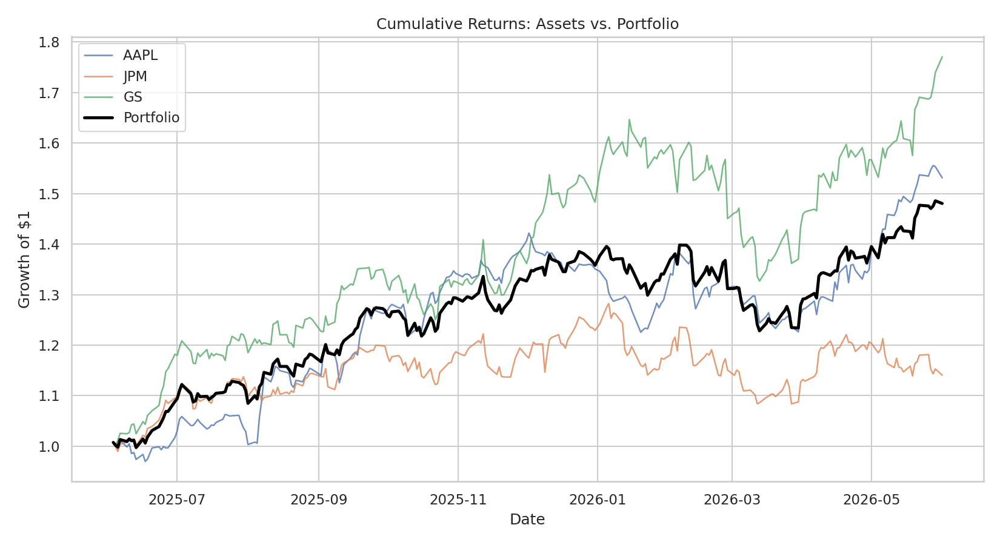
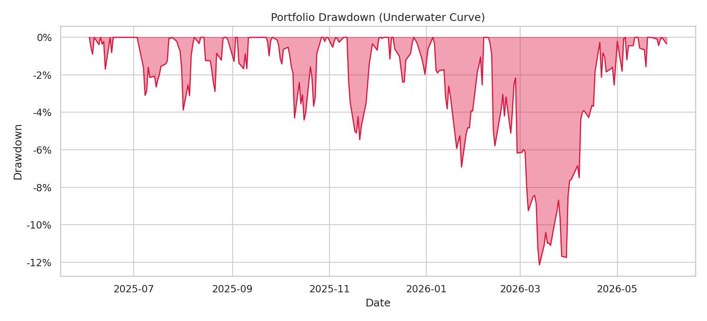

# Multi-Asset Portfolio Risk Engine

*A class project by a finance student learning how the "middle office" actually measures risk.*

## What is this project? (the short version)

For this project I wanted to go beyond just asking "did my stocks go up?" and
actually measure **how much risk** I took to get those returns. Professional
risk desks don't just look at returns — they look at volatility, drawdowns, and
worst-case losses. So I built a small Python engine that pulls real market data
and calculates the same risk metrics a junior analyst would put in a report.

I picked three stocks for the example portfolio:

- **AAPL** (Apple) — a big tech name
- **JPM** (JPMorgan) — a large bank
- **GS** (Goldman Sachs) — an investment bank

…and I split my imaginary money **40% / 30% / 30%** between them.

## What does the code actually do?

The engine (`portfolio_risk_engine.py`) is built as a Python class called
`PortfolioRiskEngine`. When you run it, it:

1. **Downloads ~1 year of daily prices** for all the tickers at once using
   `yfinance` (one request, not one per stock — much faster).
2. **Turns prices into daily returns** (the % change from one day to the next).
3. **Calculates risk metrics** for each stock *and* for the whole portfolio.
4. **Draws two charts** so I can actually *see* the risk, not just read numbers.

### The risk metrics, explained like I'd explain them to a classmate

| Metric | What it answers | Plain-English meaning |
|---|---|---|
| **Annualized Return** | "How much did it make per year?" | Average daily return scaled up to a full year (×252 trading days). |
| **Volatility** | "How bumpy was the ride?" | Standard deviation of returns. Higher = more unpredictable. |
| **Sharpe Ratio** | "Was the return worth the risk?" | Extra return above the risk-free rate, *per unit of total risk*. Higher is better. |
| **Sortino Ratio** | "…worth the *downside* risk?" | Like Sharpe, but only punishes *bad* (negative) volatility. Upside swings don't count against you. |
| **Max Drawdown** | "What was the worst loss from a peak?" | The biggest drop from a high point to a later low. Tells you the most pain you'd have felt. |
| **Value at Risk (VaR 95%)** | "How bad is a normal-bad day?" | On 95% of days, you wouldn't lose more than this. (The everyday worst case.) |
| **Conditional VaR (CVaR)** | "And when it's *really* bad?" | The *average* loss on the worst 5% of days. (The tail / crisis case.) |
| **Correlation Matrix** | "Do my stocks move together?" | If stocks don't move in sync, combining them lowers risk = diversification. |

## How to run it

```bash
pip install -r requirements.txt

# default portfolio (AAPL/JPM/GS, equal weight)
python portfolio_risk_engine.py

# my class example: custom weights + 95% confidence VaR
python portfolio_risk_engine.py -t AAPL JPM GS -w 0.4 0.3 0.3 -c 0.95
```

## My results (from a recent run)

| Metric | AAPL | JPM | GS | **Portfolio** |
|---|---|---|---|---|
| Annualized Return | 45.4% | 15.6% | 61.3% | **41.2%** |
| Volatility | 22.1% | 21.5% | 27.2% | **18.2%** |
| Max Drawdown | −13.8% | −15.5% | −19.4% | **−12.1%** |
| Sharpe Ratio | 1.87 | 0.54 | 2.11 | **2.04** |
| Sortino Ratio | 3.03 | 0.73 | 3.13 | **2.97** |
| VaR (95%) | −1.9% | −2.3% | −2.2% | **−1.6%** |
| CVaR (95%) | −2.8% | −3.2% | −3.5% | **−2.5%** |

> Note: these numbers move every time the market does, so your run will differ
> slightly. The *story* the numbers tell is what matters.

## What the charts mean

### 1. Cumulative Returns — "Growth of $1"



This chart shows what would have happened to **$1** invested in each stock over
the year. The thick black line is my **blended portfolio**.

Here's what I take away from it:

- **GS (Goldman) ends the highest** because it had the biggest return (+61%) —
  but notice how *jagged* its line is. That's the high volatility (27%) showing
  up visually: big gains, but a rough ride.
- **AAPL (Apple)** climbs almost as much but with a much **smoother** line — it
  made +45% with the least bumpiness of the three.
- **JPM (JPMorgan)** is the flattest line — it only made +16%, so it barely
  grew compared to the others.
- The **black portfolio line sits in the middle.** That's exactly what should
  happen: a blended portfolio's return is the *weighted average* of its parts,
  so it can never beat its best stock or sink below its worst. The point isn't
  to win the return race — it's that the portfolio gets a solid +41% return
  while taking **less risk than any single stock** (more on that below).

### 2. Drawdown — the "Underwater" chart



This is my favorite chart because it shows **risk**, not reward. The red area
measures how far below its previous all-time high the portfolio is at any
moment. When the line touches **0%**, the portfolio is at a new peak (happy
times). When it dips into the red, I'm "underwater" — sitting on a loss and
waiting to recover.

What it tells me:

- The **deepest dip is about −12%**, lasting roughly **60 days** before the
  portfolio climbed back to a new high. So the worst stretch of the year would
  have meant watching my money sit ~12% below its peak for about two months.
- That **−12% is actually *shallower* than every individual stock**
  (AAPL −13.8%, JPM −15.5%, GS −19.4%). This is **diversification in action**:
  the three stocks didn't all hit their lows on the same days, so the blend's
  worst moment is cushioned.

## The big lesson: why diversification shows up in the numbers

The result I'm most proud of explaining is this: the **portfolio's volatility
(18.2%) is *lower* than any single stock in it** (the lowest single stock was
JPM at 21.5%). At first that seems impossible — how can a mix be safer than its
safest ingredient?

The answer is **correlation**. My stocks don't move in perfect lockstep:

```
        AAPL    JPM     GS
AAPL    1.00   0.25   0.33
JPM     0.25   1.00   0.67
GS      0.33   0.67   1.00
```

Apple barely moves with the two banks (0.25 and 0.33), while the two banks move
together more (0.67 — which makes sense, they're both financials). Because they
don't all rise and fall on the same days, their ups and downs partly cancel
out. The engine captures this properly by computing portfolio volatility from
the **covariance matrix** (`σₚ = √(wᵀ Σ w)`) instead of just averaging the
individual volatilities — averaging would miss the diversification benefit
entirely.

Lower risk for a similar return is also why the **portfolio's Sharpe ratio
(2.04)** holds up so well — it's getting almost the same reward as the best
single stock, but more efficiently.

## The formulas (for the appendix / grading)

Daily return: `rₜ = Pₜ / Pₜ₋₁ − 1`. Everything is annualized with **252**
trading days.

- **Annualized return:** `mean(r) × 252`
- **Annualized volatility:** `std(r) × √252`
- **Sharpe ratio:** `(Rₐ − R_f) / σₐ`  (R_f = risk-free rate, here 4%)
- **Sortino ratio:** `(Rₐ − R_f) / σ_downside`  (only negative returns count)
- **Max drawdown:** `min(Cₜ / cummax(C) − 1)`, plus the longest underwater streak
- **Historical VaR (95%):** the empirical 5% quantile of daily returns
- **Conditional VaR (95%):** the average of all returns at or beyond the VaR cutoff
- **Portfolio return:** `Rₚ = wᵀ R`
- **Portfolio volatility:** `σₚ = √(wᵀ Σ w)` using the annualized covariance matrix

## Files in this repo

- `portfolio_risk_engine.py` — the engine (class-based, with a command-line interface)
- `requirements.txt` — the Python libraries you need
- `images/` — the two charts shown above, generated by the code
